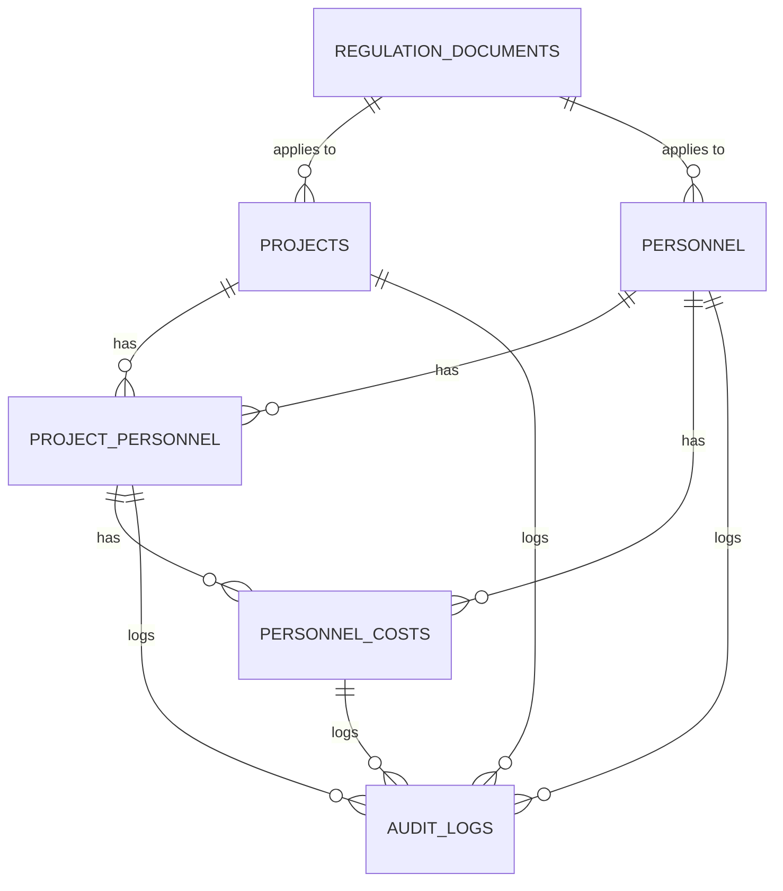

# 경기테크노파크 인건비 및 참여율 관리 시스템 - 데이터베이스 스키마

이 문서는 구현된 시스템의 데이터베이스 스키마를 상세히 설명합니다.  
PostgreSQL 데이터베이스에 적용되는 테이블 구조, 컬럼, 제약 조건, 관계를 포함합니다.

## 📋 전체 테이블 목록

1. `personnel` - 인력 정보
2. `projects` - 사업/프로젝트 정보
3. `project_personnel` - 과제참여 연결 테이블
4. `personnel_costs` - 인건비계상 내역
5. `audit_logs` - 감사 로그
6. `regulation_documents` - 규정 문서 정보

## 🏗️ 테이블별 상세 구조

### 1. personnel (인력)

| 컬럼명 | 타입 | nullable | 설명 |
|--------|------|----------|------|
| id | UUID | NO | Primary Key |
| employeeId | VARCHAR(50) | NO | 사번 (Unique) |
| name | VARCHAR(100) | NO | 이름 |
| ssn | VARCHAR(200) | NO | 암호화된 주민등록번호 |
| department | VARCHAR(100) | NO | 소속 부서 |
| team | VARCHAR(100) | NO | 현재 소속 팀 |
| position | VARCHAR(100) | NO | 직급/직위 |
| positionAverageAnnualSalary | BIGINT | YES | 직급 평균 연봉 (원) |
| employmentType | VARCHAR(20) | NO | 고용형태 (FULL_TIME, CONTRACT, PART_TIME, DISPATCHED) |
| hireDate | DATE | NO | 입사일 |
| terminationDate | DATE | YES | 퇴사일 |
| isActive | BOOLEAN | NO (DEFAULT: true) | 활성 상태 |
| salaryValidity | JSONB | NO | 급여 유효 기간 {startDate: DATE, endDate: DATE\|NULL} |
| createdAt | TIMESTAMP | NO | 생성 시각 |
| updatedAt | TIMESTAMP | NO | 수정 시각 |

**인덱스:**  
- Primary Key: `id`  
- Unique: `employeeId`  

**관계:**  
- OneToMany: `personnel` → `project_personnel` (인력당 여러 과제참여 가능)  
- OneToMany: `personnel` → `personnel_costs` (인력당 여러 인건비계상 가능)  

### 2. projects (사업)

| 컬럼명 | 타입 | nullable | 설명 |
|--------|------|----------|------|
| id | UUID | NO | Primary Key |
| name | VARCHAR(200) | NO | 프로젝트 이름 |
| projectType | VARCHAR(20) | NO | 사업유형 (NATIONAL_RD, LOCAL_SUBSIDY, MIXED) |
| managingDepartment | VARCHAR(100) | NO | 소관부서 |
| startDate | DATE | NO | 시작일 |
| endDate | DATE | NO | 종료일 |
| totalBudget | DECIMAL(15,2) | NO | 총예산 |
| personnelBudget | DECIMAL(15,2) | NO | 인건비예산 |
| status | VARCHAR(20) | NO (DEFAULT: 'PLANNING') | 상태 (PLANNING, APPROVED, IN_PROGRESS, COMPLETED, AUDITING) |
| legalBasis | JSONB | NO | 적용되는 법령 및 고시 버전 |
| internalRules | JSONB | NO | 경기테크노파크 내부 규정 |
| managingTeam | VARCHAR(100) | NO | 주관팀 |
| participatingTeams | TEXT[] | NO | 참여팀 목록 (배열) |
| createdAt | TIMESTAMP | NO | 생성 시각 |
| updatedAt | TIMESTAMP | NO | 수정 시각 |

**인덱스:**  
- Primary Key: `id`  

**관계:**  
- OneToMany: `projects` → `project_personnel` (사업당 여러 과제참여 가능)  

### 3. project_personnel (과제참여)

| 컬럼명 | 타입 | nullable | 설명 |
|--------|------|----------|------|
| id | UUID | NO | Primary Key |
| project_id | UUID | NO | Foreign Key → projects.id |
| personnel_id | UUID | NO | Foreign Key → personnel.id |
| participationRate | DECIMAL(5,2) | NO | 참여율 (0.00-100.00%) |
| startDate | DATE | NO | 참여 시작일 |
| endDate | DATE | YES | 참여 종료일 |
| calculationMethod | VARCHAR(20) | NO | 계상방법 (MONTHLY, DAILY, HOURLY) |
| expenseCode | VARCHAR(50) | NO | 비용 항목 코드 (예: "personnel-base") |
| legalBasisCode | VARCHAR(50) | NO | 법적 근거 코드 |
| participatingTeam | VARCHAR(100) | NO | 현재 참여 중인 팀 (소속팀과 다를 수 있음) |
| notes | TEXT | YES | 비고 |
| version | INTEGER | NO (DEFAULT: 1) | 낙관적 락을 위한 버전 |
| createdAt | TIMESTAMP | NO | 생성 시각 |
| updatedAt | TIMESTAMP | NO | 수정 시각 |

**인덱스:**  
- Primary Key: `id`  
- Foreign Key: `project_id` → `projects.id`  
- Foreign Key: `personnel_id` → `personnel.id`  
- Unique Constraint: `(project_id, personnel_id)` (중복 참여 방지)  

**관계:**  
- ManyToOne: `project_personnel` → `projects`  
- ManyToOne: `project_personnel` → `personnel`  
- OneToMany: `project_personnel` → `personnel_costs` (과제참여당 여러 인건비계상 가능)  

### 4. personnel_costs (인건비계상)

| 컬럼명 | 타입 | nullable | 설명 |
|--------|------|----------|------|
| id | UUID | NO | Primary Key |
| project_personnel_id | UUID | NO | Foreign Key → project_personnel.id |
| fiscalYear | INTEGER | NO | 회계년도 (예: 2024) |
| fiscalMonth | INTEGER | NO (1-12) | 회계월 |
| calculationDate | DATE | NO | 계상 일자 |
| baseSalary | DECIMAL(15,2) | NO | 기준급여 (급여대역 중점값) |
| appliedParticipationRate | DECIMAL(5,2) | NO | 적용된 참여율 |
| calculatedAmount | DECIMAL(15,2) | NO | 계산된 인건비 금액 |
| expenseItem | VARCHAR(50) | NO | 인건비 항목 (예: "base-salary", "bonus") |
| insuranceCoverage | VARCHAR(20) | NO | 4대보험 구분 (EMPLOYEE_PART, EMPLOYER_PART, FULLY_COVERED) |
| documentStatus | VARCHAR(20) | NO (DEFAULT: 'NOT_SUBMITTED') | 증빙 상태 (NOT_SUBMITTED, PENDING, APPROVED, REJECTED) |
| createdAt | TIMESTAMP | NO | 생성 시각 |
| updatedAt | TIMESTAMP | NO | 수정 시각 |

**인덱스:**  
- Primary Key: `id`  
- Foreign Key: `project_personnel_id` → `project_personnel.id`  

**관계:**  
- ManyToOne: `personnel_costs` → `project_personnel`  

### 5. audit_logs (감사 로그)

| 컬럼명 | 타입 | nullable | 설명 |
|--------|------|----------|------|
| id | UUID | NO | Primary Key |
| entityType | VARCHAR(50) | NO | 엔티티 타입 (예: 'Personnel', 'Project', 'ProjectPersonnel') |
| entityId | UUID | NO | 엔티티 ID |
| action | VARCHAR(10) | NO | 작업 유형 (CREATE, UPDATE, DELETE) |
| changes | JSONB | NO | 변경 내역 (이전 값과 새로운 값) |
| performedBy | VARCHAR(100) | NO | 작업을 수행한 사용자 ID |
| ipAddress | VARCHAR(45) | YES | 사용자 IP 주소 (IPv4/IPv6 지원) |
| userAgent | TEXT | YES | 사용자 에이전트 문자열 |
| timestamp | TIMESTAMP | NO | 로그 생성 시각 |

**인덱스:**  
- Primary Key: `id`  

### 6. regulation_documents (규정 문서)

| 컬럼명 | 타입 | nullable | 설명 |
|--------|------|----------|------|
| id | UUID | NO | Primary Key |
| title | VARCHAR(200) | NO | 문서 제목 |
| description | TEXT | NO | 문서 설명 |
| filePath | VARCHAR(500) | NO | 파일 경로 (S3/Blob Storage 경로) |
| fileType | VARCHAR(10) | NO | 파일 유형 (PDF, HWP, DOC, DOCX, TXT) |
| version | VARCHAR(20) | NO | 문서 버전 |
| effectiveDate | DATE | NO | 적용 시작일 |
| expiryDate | DATE | YES | 적용 종료일 (nullable) |
| applicableProjectTypes | TEXT[] | NO | 적용 대상 사업 유형 배열 (예: ['NATIONAL_RD', 'LOCAL_SUBSIDY']) |
| applicableTeams | TEXT[] | NO | 적용 대상 팀 배열 (빈 배열이면 전체 팀 적용) |
| createdAt | TIMESTAMP | NO | 생성 시각 |
| updatedAt | TIMESTAMP | NO | 수정 시각 |

**인덱스:**  
- Primary Key: `id`  

## 🔗 테이블 간 관계 요약



## 💾 샘플 데이터

### personnel 샘플
```sql
INSERT INTO personnel (id, employeeId, name, ssn, department, team, position, positionAverageAnnualSalary, employmentType, hireDate, isActive, salaryValidity)
VALUES 
('11111111-1111-1111-1111-111111111111', 'EMP001', 'John Doe', 'encrypted_ssn_here', 'Development', 'Backend Team', 'Senior Developer', '4000-5000', 'FULL_TIME', '2023-01-15', true, '{"startDate": "2023-01-15", "endDate": null}');
```

### projects 샘플
```sql
INSERT INTO projects (id, name, projectType, managingDepartment, startDate, endDate, totalBudget, personnelBudget, status, managingTeam, participatingTeams)
VALUES 
('22222222-2222-2222-2222-222222222222', '경기북부 테크노밸리 조성사업', 'LOCAL_SUBSIDY', '지역개발팀', '2023-01-01', '2025-12-31', 10000000000, 3000000000, 'IN_PROGRESS', '지역개발팀', ARRAY['지역개발팀', '인프라팀', '환경팀']);
```

### project_personnel 샘플
```sql
INSERT INTO project_personnel (id, project_id, personnel_id, participationRate, startDate, endDate, calculationMethod, expenseCode, legalBasisCode, participatingTeam, version)
VALUES 
('33333333-3333-3333-3333-333333333333', '22222222-2222-2222-2222-222222222222', '11111111-1111-1111-1111-111111111111', 75.00, '2023-01-15', null, 'MONTHLY', 'personnel-base', 'LEGAL_001', 'Backend Team', 1);
```

### personnel_costs 샘플
```sql
INSERT INTO personnel_costs (id, project_personnel_id, fiscalYear, fiscalMonth, calculationDate, baseSalary, appliedParticipationRate, calculatedAmount, expenseItem, insuranceCoverage, documentStatus)
VALUES 
('44444444-4444-4444-4444-444444444444', '33333333-3333-3333-3333-333333333333', 2024, 1, '2024-01-15', 45000000, 75.00, 33750000, 'base-salary', 'EMPLOYER_PART', 'NOT_SUBMITTED');
```

## 🛠️ 인덱스 및 성능 최적화 권고사항

### 필수 인덱스
1. `personnel.employeeId` (Unique)
2. `project_personnel.project_id`
3. `project_personnel.personnel_id`
4. `project_personnel.(project_id, personnel_id)` (Unique)
5. `personnel_costs.project_personnel_id`
6. `audit_logs.entityType`
7. `audit_logs.entityId`
8. `audit_logs.timestamp`
9. `regulation_documents.applicableProjectTypes` (GIN 인덱스 권장)
10. `regulation_documents.applicableTeams` (GIN 인덱스 권장)

### 파티셔닝 권고 (대용량 데이터용)
- `personnel_costs` 테이블: `fiscalYear` 또는 `calculationDate` 기준 범위 파티셔닝
- `audit_logs` 테이블: `timestamp` 기준 월별 또는 연간 파티셔닝

## 🔄 마이그레이션 스크립트 예시

### 테이블 생성 순서
1. personnel
2. projects  
3. project_personnel
4. personnel_costs
5. audit_logs
6. regulation_documents

### 외래 키 제약 조건 추가 순서
1. project_personnel → personnel (personnel_id)
2. project_personnel → projects (project_id)
3. personnel_costs → project_personnel (project_personnel_id)
4. audit_logs → personnel (entityId, entityType='Personnel')
5. audit_logs → projects (entityId, entityType='Project')
6. audit_logs → project_personnel (entityId, entityType='ProjectPersonnel')
7. audit_logs → personnel_costs (entityId, entityType='PersonnelCost')

## 📈 향후 확장성 고려사항

1. **다국어 지원**: 제목/설명 필드에 다국어 컬럼 추가 예정
2. **문서 버전 관리**: 기존 규정을 대체하지 않고 버전별로 보존하는 구조
3. **알림 테이블 추가**: 참여율 초과 알림 등을 영구 저장하기 위한 테이블
4. **통계 뷰**: 월별/분기별 인건비 집계 등을 위한 자료 뷰
5. **소프트 삭제**: 실제 삭제 대신 삭제 플래그 추가 옵션

## 📝 참고 사항

- 모든 날짜 필드는 UTC 기준으로 저장되며, 애플리케이션 레벨에서 timezone 변환을 처리합니다.
- JSONB 컬럼은 유연한 스키마 변경을 위해 사용되며, 필요한 경우 일반 컬럼으로 마이그레이션 가능합니다.
- VARCHAR 길이 는 실제 데이터 분포를 고려하여 충분히 크게 설정되었습니다.
- 보안을 위해 주민등록번호(SSN)는 반드시 암호화하여 저장해야 합니다 (현재는 플레이스홀더 구현).
- 급여대역은 "최소-최대" 형식의 문자열로 저장되며, 계산 시 중간값을 사용합니다.
